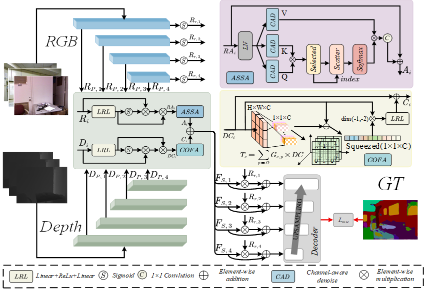
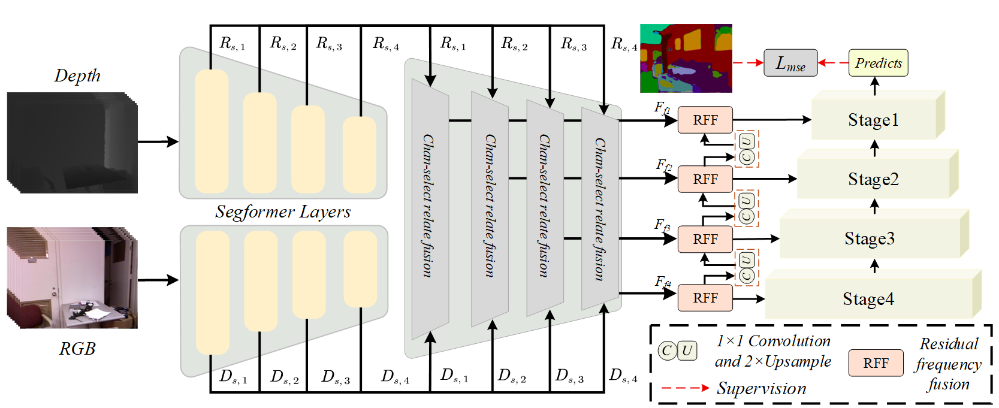
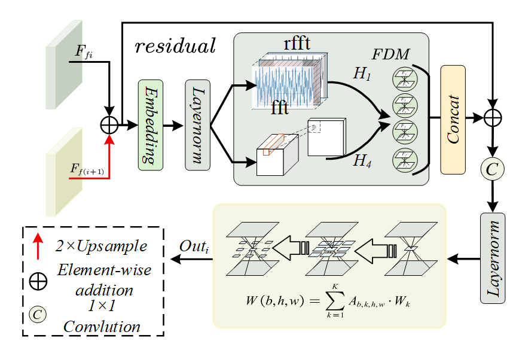

# CETML-Framework
# Align and Purify: Cross-Domain Edge-Detail-Aware Transfer Mutual Learning Framework

This repository provides the code and results for "Align and Purify: Cross-Domain Edge-Detail-Aware Transfer Mutual Learning Framework for RGB-D Indoor Semantic Segmentation"

---

## Requirements

- Python 3.7+
- PyTorch 1.5+
- CUDA 10.2+
- TensorboardX 2.1+
- opencv-python

---

## Architecture and Details

  

- Proposed Cross-Domain Edge-Detail-Aware Transfer Mutual Learning Framework

  

- Proposed spatial-aware geometric constrained network(SGCNet)

  

- Proposed frequency aware texture-detail network(FATNet)

  

- Proposed residual fourier Fusion (RFF) module
---

## Results
---- Results compared with some methods on NYUV2 Datasets

  

